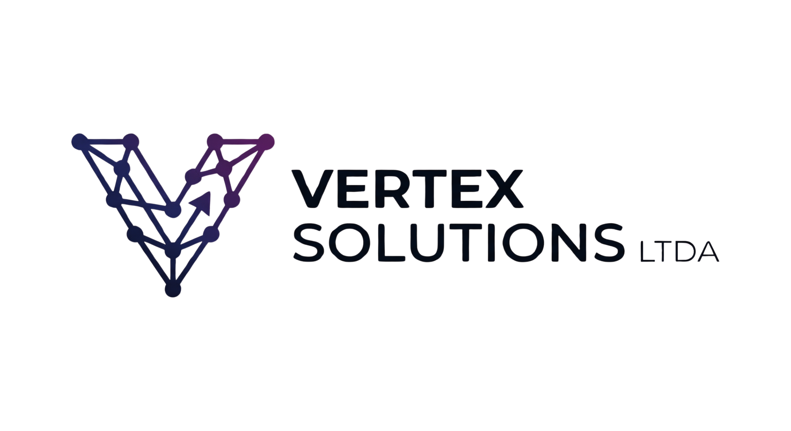

<div align="center">
    
    <h1>Vertex Oh Pro!</h1>
    <p><strong>Plataforma SaaS de Produtividade Pedagógica e Gestão de Sala de Aula</strong></p>


<a href="https://laravel.com"></a>
<a href="https://tailwindcss.com"></a>
<a href="https://livewire.laravel.com"></a>
<a href="https://alpinejs.dev"></a>

</div>


---

## 🚀 Sobre o Projeto

O **Vertex Oh Pro!** é uma plataforma SaaS independente e robusta, desenvolvida para transformar a rotina de professores brasileiros. Com foco em automação pedagógica alinhada à **BNCC**, gestão eficiente de sala de aula e um marketplace exclusivo de materiais didáticos, o sistema oferece uma experiência "premium" e totalmente integrada.

A arquitetura foi desenhada para ser **Local-First**, garantindo performance e independência de serviços externos (CDNs), ideal para ambientes de hospedagem compartilhada (Hostinger) sem sacrificar a modernidade e a reatividade.

## 🛠️ Stack Tecnológica

O projeto utiliza o que há de mais moderno no ecossistema PHP/Laravel, garantindo manutenibilidade e escalabilidade:

- **Backend:** [Laravel 12.x](https://laravel.com)
- **Arquitetura:** Modular via [nwidart/laravel-modules](https://nwidart.com/laravel-modules)
- **Frontend:** [Livewire 3.x](https://livewire.laravel.com) + [Alpine.js](https://alpinejs.dev)
- **Estilização:** [Tailwind CSS v4.1](https://tailwindcss.com) (Configuração "CSS-first")
- **Build Tool:** [Vite](https://vitejs.dev)
- **Database:** MySQL

### 🔒 Filosofia Local-First & Segurança
- **Zero CDNs:** Todas as fontes (Inter, Poppins), ícones (FontAwesome Pro 7.1) e bibliotecas JS são hospedadas e servidas localmente.
- **Dark Mode Nativo:** Implementado via CSS Variables e Tailwind v4.
- **Interatividade:** Long Polling otimizado (AJAX) para atualizações em tempo real sem dependência de WebSockets/Reverb.

## 🧩 Módulos do Sistema

O sistema é dividido em domínios de responsabilidade bem definidos:

| Módulo           | Responsabilidade                                                      |
| :--------------- | :-------------------------------------------------------------------- |
| **Core**         | Componentes globais, layouts, autenticação e serviços base.           |
| **Admin**        | Painel administrativo para gestão de usuários, planos e moderação.    |
| **TeacherPanel** | Dashboard do professor com widgets interativos e personalizáveis.     |
| **Planning**     | Editor de planos de aula alinhado à BNCC com templates profissionais. |
| **ClassRecord**  | Diário de classe digital, frequência e fechamento de notas.           |
| **Library**      | Marketplace de conteúdos e atividades com downloads seguros.          |
| **Billing**      | Gestão de assinaturas via Stripe/MercadoPago.                         |
| **Support**      | Sistema de tickets e chat integrado.                                  |

## ⚙️ Instalação e Configuração

Siga os passos abaixo para configurar o ambiente de desenvolvimento:

1.  **Clone o repositório**
    ```bash
    git clone https://github.com/vertexsolutions/vertex-oh-pro.git
    cd vertex-oh-pro
    ```

2.  **Instale as dependências**
    ```bash
    composer install
    npm install
    ```

3.  **Configure o ambiente**
    ```bash
    cp .env.example .env
    php artisan key:generate
    ```

4.  **Banco de Dados**
    Crie um banco de dados MySQL e configure as credenciais no `.env`. Em seguida, execute as migrações:
    ```bash
    php artisan migrate --seed
    ```

5.  **Compile os Assets**
    Para desenvolvimento:
    ```bash
    npm run dev
    ```
    Para produção (gera os arquivos finais em `public/build`):
    ```bash
    npm run build
    ```

## 👨‍💻 Autor e Créditos

<div align="left">
    
    <br>
    <strong>Reinan Rodrigues</strong><br>
    <em>Full Stack Developer & Architect</em>
</div>

---

<div align="center">
    
    <p>Desenvolvido com ❤️ pela <strong>Vertex Solutions LTDA.</strong></p>
    <p>© 2026 Vertex Solutions LTDA. Todos os direitos reservados.</p>
</div>
